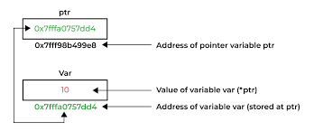

#  🪝 POINTERS IN C

A pointer is a variable that stores the memory address of another variable. Instead of holding a direct value, it holds the address where the value is stored in memory. It is the backbone of low-level memory manipulation in C.

-   A pointer is declared by specifying its data type and name, with an asterisk (*) before the name. **Syntax:** `data_type *pointer_name;`
-   The data type indicates the type of variable the pointer can point to. For example, `int *ptr;` declares a pointer to an integer.
-   Accessing the pointer directly will just give us the address that is stored in the pointer. To get the value at the address stored in a pointer variable, we use `*` operator which is call dereferencing operator in C
-   Note that we use * for two different purposes in pointers. One is to declare a pointer variable and the other is in an operator to get the value stored at address stored in pointer.

*This hexadecimal integer (starting with 0x) is the memory address.*



---

##  📋 Initialize the Pointer


-   A pointer is initialized by assigning it the address of a variable using the address operator (&).

-   **Syntax:** `pointer_name = &variable;`

-   Initializing a pointer ensures it points to a valid memory location before use.

-   You can also initialize a pointer to NULL if it doesn’t point to any variable yet: `int *ptr = NULL;`

---

##  🦾 Dereference a Pointer

We have to first dereference the pointer to access the value present at the memory address. This is done with the help of **dereferencing operator(*)** (same operator used in declaration).

-   **EXAMPLE:**
```c
#include<stdio.h>

int main(){

    int a=10;

    //store addess of a variable
    int* ptr=&a;

    //dereferencing ptr to access the value
    printf("%d\n",*ptr);

    return 0;
}
```
**Note:** *Earlier, we used `%d` for printing pointers, but C provides a separate format specifier `%p` for printing pointers.*

---

##  🎡 Size of Pointer

The size of a pointer in C depends on the architecture (bit system) of the machine, not the data type it points to.

-   On a 32-bit system, all pointers typically occupy 4 bytes.

-   On a 32-bit system, all pointers typically occupy 4 bytes.

The size remains constant regardless of the data type `(int*, char*, float*, etc.)`. We can verify this using the `sizeof operator`.

**Note:** *The actual size of the pointer may vary depending on the compiler and system architecture, but it is always uniform across all data types on the same system.*

---
##  🩷 Special Types of Pointers

There are 4 special types of pointers that used or referred to in different contexts:

-   ## NULL Pointer👎
    -   The NULL Pointers are those pointers that do not point to any memory location.
    -   They can be created by assigning NULL value to the pointer. A pointer of any type can be assigned the NULL value.
    -   This allows us to check whether the pointer is pointing to any valid memory location by checking if it is equal to NULL.
-   ## Void Pointer🫗
    -   The void pointers in C are the pointers of type void.
    -   It means that they do not have any associated data type.
    -   They are also called generic pointers as they can point to any type and can be typecasted to any type.
-   ## Wild Pointer🤑
    The wild pointers are pointers that have not been initialized with something yet. These types of C-pointers can cause problems in our programs and can eventually cause them to crash. If values are updated using wild pointers, they could cause data abort or data corruption.
-   ## Dangling Pointer🪄
    -   A pointer pointing to a memory location that has been deleted (or freed) is called a dangling pointer.
    -   Such a situation can lead to unexpected behavior in the program and also serve as a source of bugs in C programs.

---

##  ➕ Pointer Arthimetic

The pointer arithmetic refers to the arithmetic operations that can be performed on a pointer. It is slightly different from the ones that we generally use for mathematical calculations as only a limited set of operations can be performed on pointers. These operations include:

-   Increment/Decrement
-   Addition/Subtraction of Integer
-   Subtracting Two Pointers of Same Type
-   Comparing/Assigning Two Pointers of Same Type
-    Comparing/Assigning with NULL

---
##  🙈 Constant Pointers

In constant pointers, the memory address stored inside the pointer is constant and cannot be modified once it is defined. It will always point to the same memory address.

-   **Example:**
    ```C
    #include <stdio.h>

    int main() {
        int a = 90;
        int b = 50;

        // Creating a constant pointer
        int* const ptr = &a;
        
        // Trying to reassign it to b
        ptr = &b;

        return 0;
    }
    ```
    above program cant be compiled becouse trying to reassing ptr with b variable constant variable cant be modifide

---

## 🧱 Multilevel Pointer 

In C, we can create multi-level pointers with any number of levels such as – `***ptr3`, `****ptr4`, `******ptr5` and so on. Most popular of them is **double pointer** (pointer to pointer). It stores the memory address of another pointer. Instead of pointing to a data value, they point to another pointer.

##  Advantages of Pointers

-   Pointers are used for dynamic memory allocation and deallocation.
-   An Array or a structure can be accessed efficiently with pointers
-   Pointers are useful for accessing memory locations.
-   Pointers are used to form complex data structures such as linked lists, graphs, trees, etc.
-   Pointers reduce the length of the program and its execution time as well.

##  Issuse with Pointers

-   Memory corruption can occur if an incorrect value is provided to pointers.
-   Pointers are a little bit complex to understand.
-   Pointers are majorly responsible for memory leaks in C.
-   Accessing using pointers are comparatively slower than variables in C.
-   Uninitialized pointers might cause a segmentation fault.